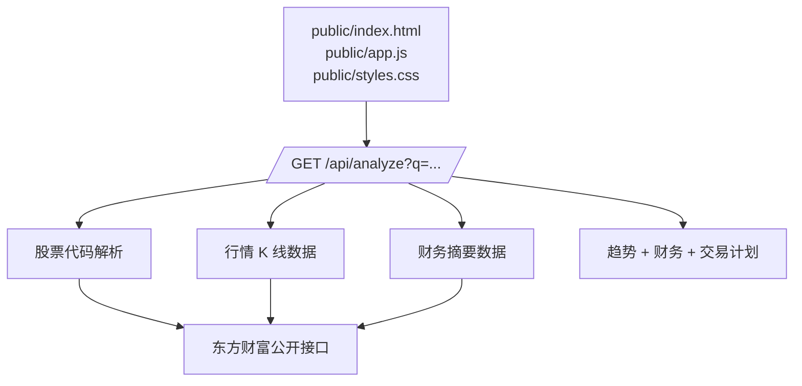
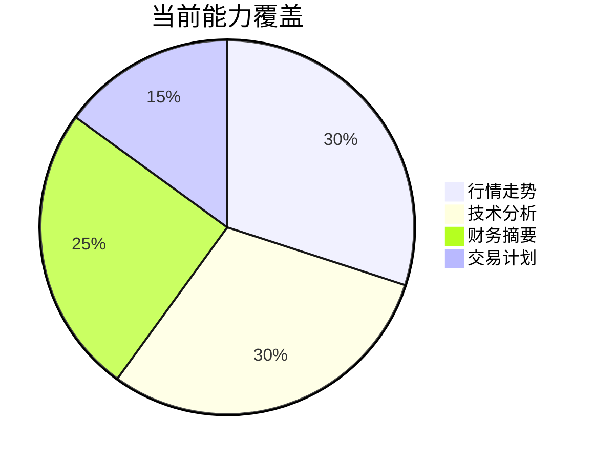

# Stock Analyzer

一个轻量级股票走势分析工具，支持 A 股、港股、美股代码或名称检索，自动汇总行情走势、技术信号、交易计划和公司财务情况。

> 适合用来快速做盘前观察、个股复盘和多周期交易计划整理。  
> 本项目只做数据分析和风险提示，不构成投资建议。

## 项目结构

```
stock-analyzer/
├── server.js          # Node.js 后端：多源行情 API（新浪→腾讯→东方财富回退）
├── public/            # 原 Web 版（保留可用）
├── render.yaml        # Render 部署配置
└── mobile/            # React Native (Expo) iOS App
    ├── app/           # Expo Router 页面（自选/搜索/分析/付费墙/设置）
    ├── src/           # API 客户端、状态管理、主题、组件、订阅
    ├── ios/           # prebuild 生成的原生工程 + PrivacyInfo.xcprivacy
    ├── docs/APPSTORE-GUIDE.md   # 上架操作手册
    └── eas.json       # EAS Build 配置
```

## 两种使用方式

### Web 版（原有）
```bash
npm start          # http://127.0.0.1:4173
```

### iOS App 版（新增）
```bash
cd mobile
npx expo run:ios   # 模拟器运行
```
上架流程见 `mobile/docs/APPSTORE-GUIDE.md`。

## 后端 API

| 端点 | 说明 |
| --- | --- |
| `GET /api/health` | 健康检查 |
| `GET /api/analyze?q=` | 聚合分析（行情+财务+周期+计划，兼容旧 Web） |
| `GET /api/search?q=` | 搜索/解析证券 |
| `GET /api/quote?q=` | 实时报价（多源回退） |
| `GET /api/kline?q=&days=&klt=` | K 线数据 |
| `GET /api/finance?q=` | 财务摘要 |

实时报价多源链：新浪 → 腾讯 → 东方财富，自动容错，GBK 编码已处理。

## Highlights

| 模块 | 能力 | 结果 |
| --- | --- | --- |
| 🔎 股票检索 | 支持代码和名称输入 | A 股、港股、美股快速匹配 |
| 📈 技术分析 | 当日、当周、当月多周期判断 | 趋势、支撑位、压力位、量能倍数 |
| 🧾 财务摘要 | 读取公开财务指标 | 营收、归母净利润、毛利率、ROE、市盈率 |
| 🧠 交易计划 | 结合多周期强弱 | 买入区间、卖出区间、止损提示 |
| 🎨 可视化 | Canvas 走势 chart + 财务柱状图 | 更直观地观察价格和基本面变化 |

## Preview

```text
┌──────────────────────────────────────────────────────────────┐
│ 股票走势分析                                      [分析按钮]  │
├──────────────────────────────────────────────────────────────┤
│ 贵州茅台 · 600519                         最新价 1,xxx.xx    │
│                                                              │
│   📈 近一个月走势折线图                                      │
│                                                              │
├───────────────────────┬──────────────────────────────────────┤
│ 公司财务情况           │ 综合结论                             │
│ 营收 / 净利润柱状图     │ 偏多 / 观望 / 防守                   │
│ PE · ROE · 毛利率       │ 买入、卖出、止损区间                 │
└───────────────────────┴──────────────────────────────────────┘
```

## 分析流程


## 系统结构



## 界面内容

- **顶部搜索栏**：输入 `AAPL`、`0700`、`600519`、`贵州茅台` 等关键词。
- **价格走势图**：展示近一个月收盘走势，辅助观察趋势方向。
- **公司财务情况**：展示盈利状态、营收规模、归母净利润、毛利率、净利率、ROE、资产负债率、EPS。
- **综合结论**：根据多周期趋势生成偏多、观望或防守判断。
- **周期卡片**：分别输出当日、当周、当月的支撑位、压力位、均线和量能信息。

## 本地运行

```bash
npm start
```

默认访问地址：

```text
http://127.0.0.1:4173
```

指定端口：

```bash
PORT=4177 npm start
```

## 部署

这是一个 Node.js 服务，前端会调用 `/api/analyze` 获取实时行情和财务数据。因此它不能只用 GitHub Pages 完整运行，需要部署到支持 Node.js 的平台。

推荐平台：

| 平台 | 适配情况 | 说明 |
| --- | --- | --- |
| Render | ✅ 推荐 | 仓库已包含 `render.yaml` |
| Railway | ✅ 可用 | 使用 `npm start` 启动 |
| Fly.io | ✅ 可用 | 适合长期运行 Node 服务 |
| GitHub Pages | ❌ 不适合 | 只能托管静态文件，不能运行 API |

Render 部署配置已包含在仓库中：

```yaml
services:
  - type: web
    name: stock-analyzer
    runtime: node
    buildCommand: ""
    startCommand: npm start
```

## 数据与风险说明

- 行情和财务数据来自公开数据接口，可能存在延迟、缺失或字段变化。
- 技术信号只反映当前数据下的统计判断，不代表未来收益。
- 买入区间、卖出区间和止损提示仅用于辅助复盘，实际交易需结合个人资金管理和最新公告。

## Project Status



## License

Personal project. All rights reserved.
